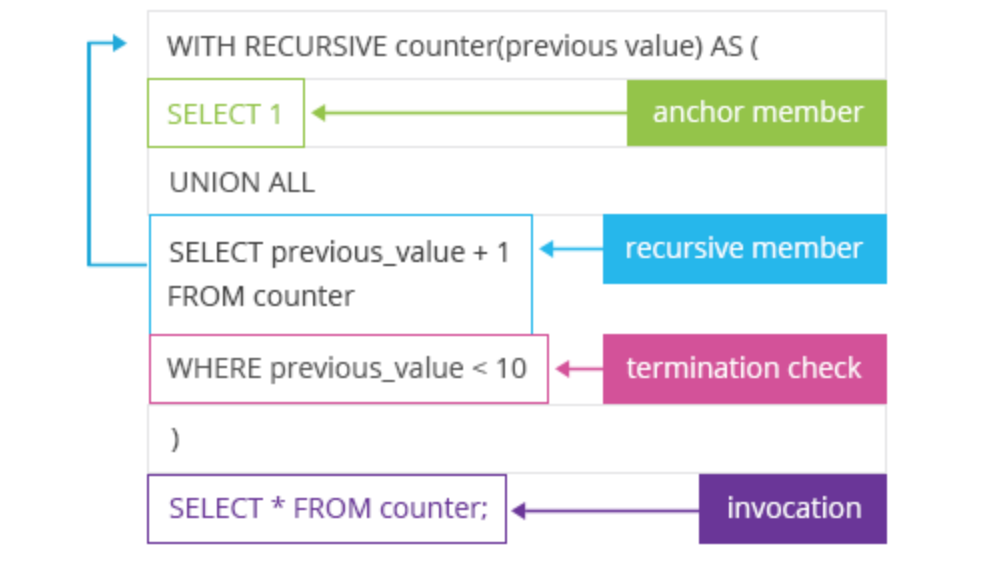

# Recursive-SQL-Queries-1



## 1.0 Introduction

In this report, I present an in-depth exploration of recursive SQL queries, a powerful feature in SQL that allows for the efficient querying of hierarchical and graph-based data structures. Recursive queries are particularly useful for tasks such as traversing organizational charts, managing bill of materials, and handling graph algorithms. My objective is to demonstrate the practical applications of recursive SQL queries through various examples and use cases.

_The recursive query consists of two main parts: a "anchor" query that defines the starting point, and a "recursive" query that performs the iterative process to retrieve the remaining data. The recursive query continues to call itself until a specified termination condition is met._

## 2.0 Problem Statement

The primary goal of this project is to illustrate the utility and implementation of recursive SQL queries. Specifically, I aim to address the following questions:
- What are recursive SQL queries, and how do they work?
- Display number from 1 to 10 without using any in built functions.
- Display number from 1 to 20 and the corresponding even and odd numbers without using any in built functions.
- Find the hierarchy of employees under a given manager.
- Find the hierarchy of managers for a given employee.
- What are the performance considerations and best practices when using recursive SQL queries?

### 2.1 To display number from 1 to 10 without using any in built functions.
```SQL
with recursive CTE (n) as
( 
 select 1 as n
	union
 select 1 + n as n
	from CTE
	where n <= 9
)
select * from CTE

```


**_The execution of the query above goes as follow:_**

- The WITH RECURSIVE clause is used to define the CTE.
- The CTE is named CTE and has a single column n.
- The first part of the CTE, SELECT 1 AS n, is the anchor member. It defines the starting point of the sequence, which is the number 1.
- The second part of the CTE, SELECT 1 + n AS n FROM CTE WHERE n <= 9, is the recursive member. It takes the previous value of n (starting from 1) and increments it by 1, generating the next number in the sequence. The - WHERE n <= 9 condition ensures that the recursion stops when n reaches 10.
- The final SELECT * FROM CTE query retrieves the results of the recursive CTE, which will be the sequence of numbers from 1 to 10.

### 2.2 To display number from 1 to 20 and the corresponding even and odd numbers without using any in built functions.

```SQL
with recursive CTE (sr_no, odd_no, even_no) as 
(select 1,1,2
union
select sr_no + 1, odd_no + 2, even_no + 2
from CTE
where sr_no <= 19)
select * 
from CTE;

```


###   To create table and load data into the data base

```SQL
DROP TABLE IF EXISTS emp_details;
CREATE TABLE emp_details
    (
        id           int PRIMARY KEY,
        name         varchar(100),
        manager_id   int,
        salary       int,
        designation  varchar(100)

    );

INSERT INTO emp_details VALUES (1,  'Shripadh', NULL, 10000, 'CEO');
INSERT INTO emp_details VALUES (2,  'Satya', 5, 1400, 'Software Engineer');
INSERT INTO emp_details VALUES (3,  'Jia', 5, 500, 'Data Analyst');
INSERT INTO emp_details VALUES (4,  'David', 5, 1800, 'Data Scientist');
INSERT INTO emp_details VALUES (5,  'Michael', 7, 3000, 'Manager');
INSERT INTO emp_details VALUES (6,  'Arvind', 7, 2400, 'Architect');
INSERT INTO emp_details VALUES (7,  'Asha', 1, 4200, 'CTO');
INSERT INTO emp_details VALUES (8,  'Maryam', 1, 3500, 'Manager');
INSERT INTO emp_details VALUES (9,  'Reshma', 8, 2000, 'Business Analyst');
INSERT INTO emp_details VALUES (10, 'Akshay', 8, 2500, 'Java Developer');
commit;

SELECT * from emp_details;

```


### 2.3 To find the hierarchy of employees under a given manager "Asha".

```SQL
-- Find the hierarchy of managers for a given employee "Asha".

with recursive emp_hierarchy as (
select id, name, manager_id,designation, 1 as level
	from emp_details
	where name = 'Asha'
union 
select E.id, E.name, E.manager_id, E.designation, 1 + H.level as level
	from emp_hierarchy H
	join emp_details E
	on H.id = E.manager_id
)
select E2.name as manager_name, E2.id as manager_id, H2.name as emp_name, H2.id as emp_id,level
from emp_hierarchy H2
join emp_details E2
on E2.id = H2.manager_id

```


### 2.4 To find the hierarchy of managers for a given employee "David".
```SQL
with recursive emp_hierarchy as (
select id, name, manager_id,designation, 1 as level
	from emp_details
	where name = 'David'
union 
select E.id, E.name, E.manager_id, E.designation, 1 + H.level as level
	from emp_hierarchy H
	join emp_details E
	on H.manager_id = E.id
)
select E2.name as manager_name, E2.id as manager_id, H2.name as emp_name, H2.id as emp_id,level
from emp_hierarchy H2
join emp_details E2
on E2.id = H2.manager_id
```


## 3.0 Skills Demonstrated

**_Through this project, I demonstrate my proficiency in:_**
- Understanding and implementing recursive SQL queries.
- Analyzing and modeling hierarchical data structures.
- Optimizing SQL queries for performance.
- Applying SQL to solve real-world data problems.
- Presenting complex technical concepts in an understandable manner.

## 4.0 Performance Considerations

**_When working with recursive queries, performance can be a critical issue, especially with deep or broad hierarchies. Key considerations include:_**
- _Indexing:_ Proper indexing on key columns such as IDs and parent IDs to speed up joins.
- _Query Optimization:_ Limiting the depth of recursion where possible and using efficient query structures.
- _Database Configuration:_ Ensuring the database is configured to handle recursive queries efficiently.

## 5.0 Conclusion and Recommendation
**_Recursive SQL queries are a powerful tool for managing and querying hierarchical data structures. Through this project, I demonstrated their utility in various scenarios, from organizational charts to product assemblies and network graphs. Key insights include:_**
- _Utility in Hierarchical Data:_ Recursive queries simplify the process of traversing and analyzing hierarchical data.
- _Performance Management:_ Proper indexing and optimization techniques are crucial for maintaining query performance.


